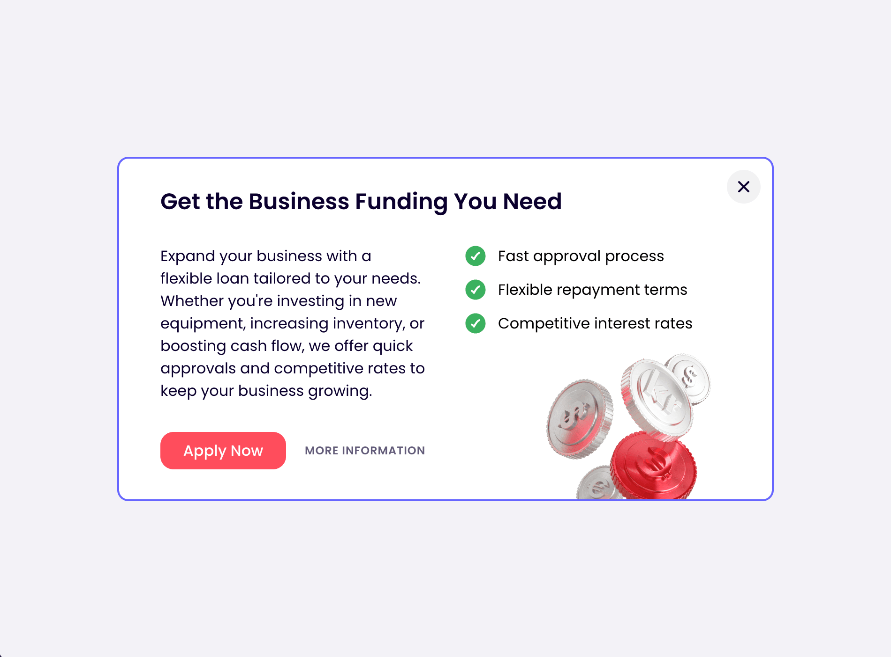
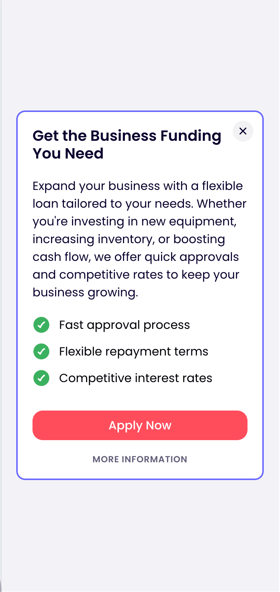

# Finom — Responsive Funding Banner

[**Live demo**](https://olchu.github.io/test-assignment/) · Built with **React + TypeScript + Vite**

> A small, “alive” promo banner in a fintech style. Fully responsive from **320 px** up, with soft hover states, an animated illustration, accessible markup, and a safe external link.

---

## What this project does

- Renders a **marketing banner** with a title, description, benefits list, and two CTAs: `Apply Now` and `More information`.
- **Alive UI**: subtle hover states and a gentle floating animation on the illustration (disabled for users who prefer reduced motion).
- **Responsive**: single-column layout at ≤ 600 px (mobile), two columns on larger screens; works reliably from **320 px**.
- **Close behavior**: clicking the cross icon **removes the banner from the DOM** (per the task requirement).
- **External link**: `More information` safely opens `finom.co` in a new tab (`rel="noopener noreferrer"`).
- **Accessibility**: semantic structure (`<section>`, heading, real `<ul>` list), visible focus rings, and ARIA labels.
- **Testing & hooks**: unit test asserts the banner is **removed from the DOM on close**; **Husky v9 hooks** run type checks, lint-staged, and tests automatically (details below).

## How to run

### Local development

git clone https://github.com/olchu/test-assignment.git
cd test-assignment
npm install
npm run dev

# Open http://localhost:5173/

### Production build

npm run build
npm run preview

### Deployment (GitHub Pages)

Auto-deploy via GitHub Actions on push to main.  
Published: https://olchu.github.io/test-assignment/

## Tech stack

- React 18 + TypeScript
- Vite
- CSS Modules
- Poppins (Google Fonts)
- Semantic HTML & a11y
- Vitest & React Testing Library

## Quality & DX

- **Husky v9 hooks**
  - pre-commit → `npm run typecheck && npx lint-staged`
  - pre-push → `npm run test:ci`
- Lint-Staged formats/lints only staged files
- ESLint + Prettier configs included

## Testing

- Vitest + React Testing Library + `@testing-library/jest-dom`
- Test: `src/components/ui/Banner/Banner.test.tsx`
- Checks: clicking `data-testid="banner-btn-close"` removes `data-testid="banner-element"` from the document (via `animationend/transitionend` simulation).

Run:
npm run test
npm run test:ci

## Key decisions & why

- `<section>` as container; ARIA label for screen readers
- Decomposition: Banner, Title, List/ListItem, Button
- Fluid typography with `clamp()`
- Hover only on hover-capable devices
- Decorative absolute image (`alt=""`), motion disabled on `prefers-reduced-motion`
- Zero UI deps

## Screenshots

## Project structure

# (same as above)

## Task reference

- Public link (Pages)
- “Alive” interactions
- Mobile breakpoint 600 px (supports 320 px)
- External link to finom.co
- Close removes from DOM

License: MIT
